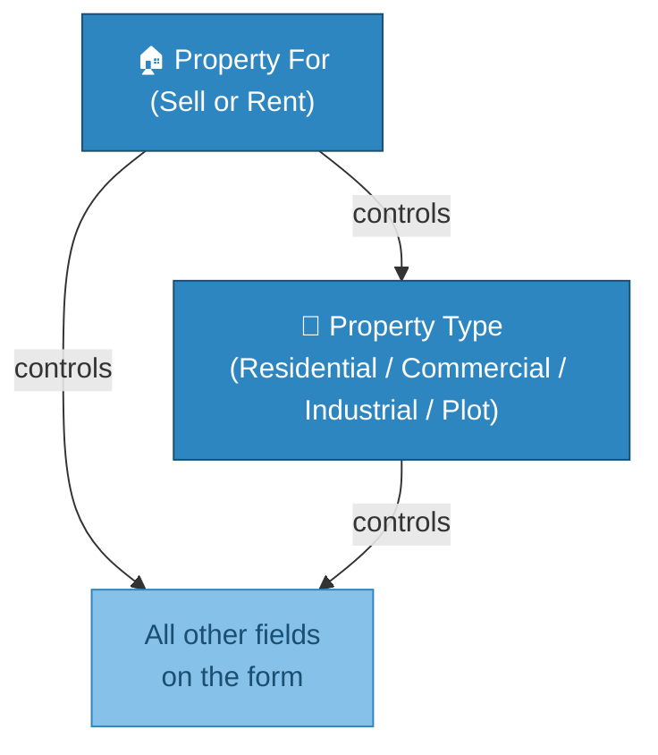
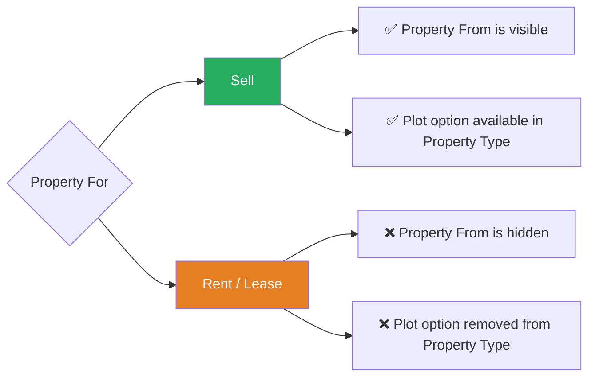
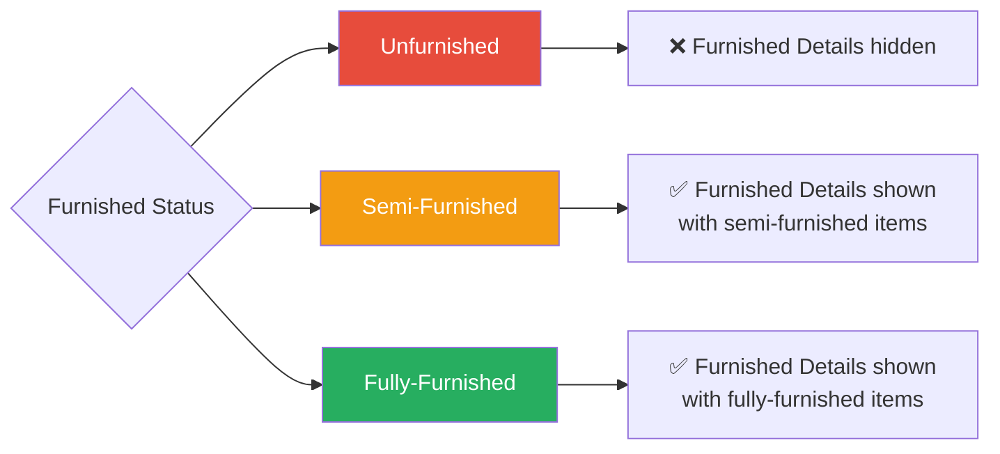
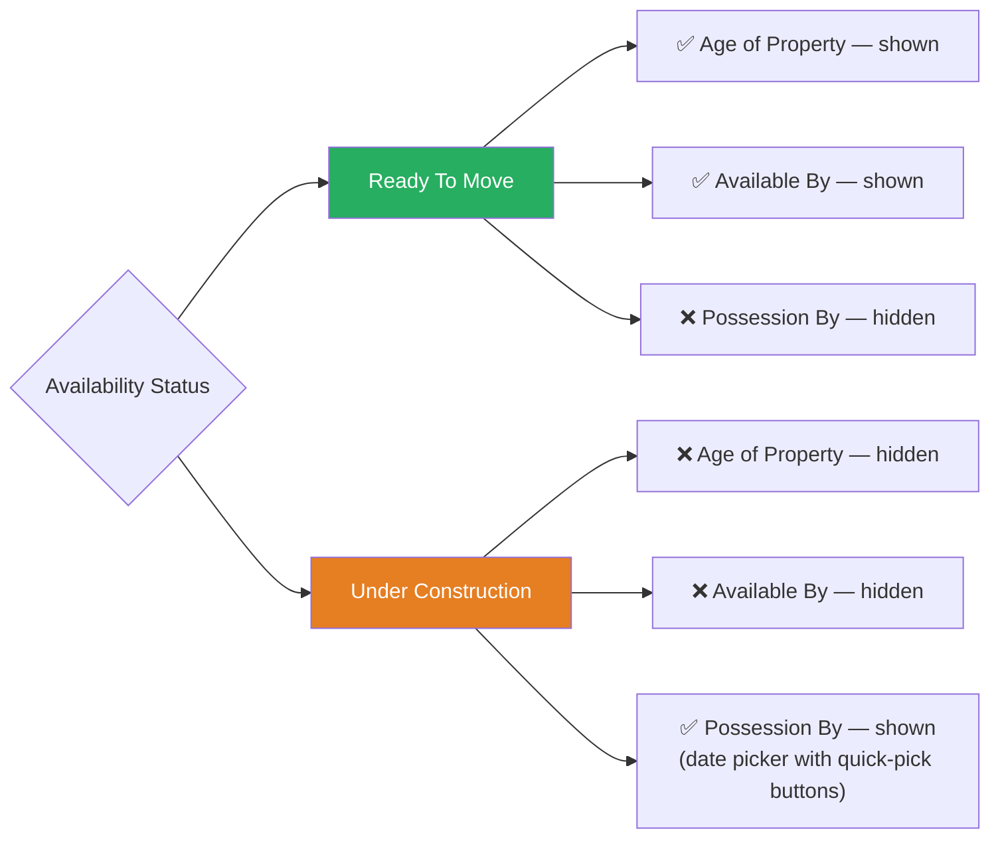
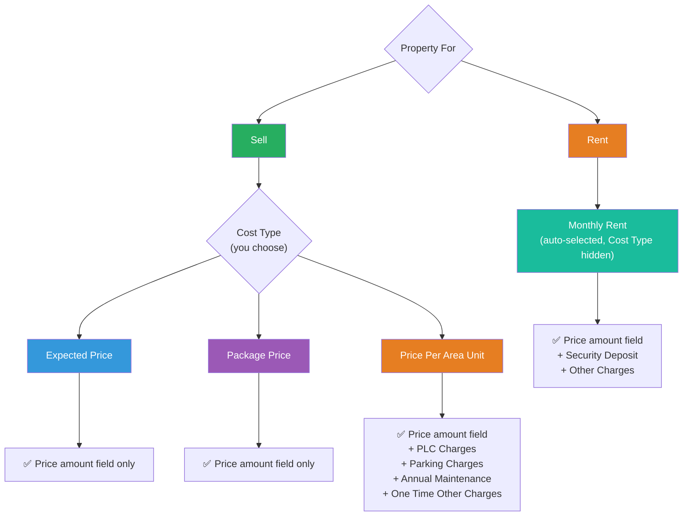
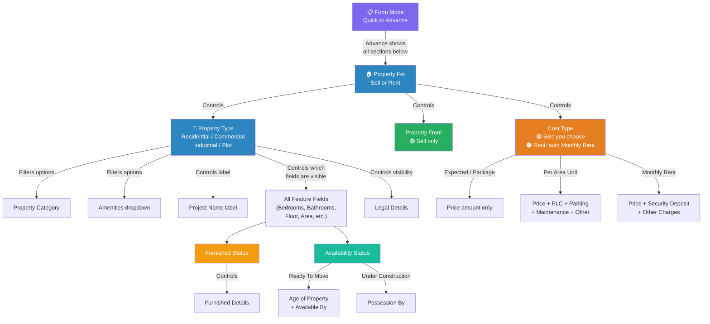

# Add Property Form — Field Guide & Dependencies

> This document explains every field in the **Add Property** form, what it does, and which fields appear or disappear based on your selections.

---

## 📋 How the Form Works

The form has two modes:

| Mode | What you see |
|------|-------------|
| **Quick** | Only the essential fields — Property For, Property Type, Category, Project Name, Address, Area, and Price |
| **Advance** | All fields — everything in Quick mode plus Features, Amenities, Legal Details, Media uploads, and Private Details |

> [!IMPORTANT]
> The two most important fields are **Property For** and **Property Type**. Almost every other field on the form depends on one or both of these selections.

---

## 🔗 Master Dependency Chain

> When you change **Property For**, it automatically re-evaluates **Property Type** and everything below it. When you change **Property Type**, it re-evaluates all feature, amenity, and legal fields.

---

## Section 1: Overview

| # | Field Name | Required? | What it does |
|---|-----------|-----------|-------------|
| 1 | **Property For** | ✅ Yes | Choose **Sell** or **Rent/Lease** |
| 2 | **Property From** | ✅ Yes | Choose **Owner (Resale)** or **Developer (First Sale)** |
| 3 | **Property Type** | ✅ Yes | Choose **Residential**, **Commercial**, **Industrial**, or **Plot** |
| 4 | **Property Category** | ✅ Yes | Subcategory (e.g., Flat, Bungalow, Office Space, Warehouse, etc.) |

### Dependencies in this section

- **Property Category** options change depending on **Property Type**:
  - *Residential* → Flat, Bungalow, Penthouse, Villa, etc.
  - *Commercial* → Office Space, Shop, Showroom, etc.
  - *Industrial* → Warehouse, Factory, etc.
  - *Plot* → Residential Plot, Commercial Plot, Agricultural Land, etc.

---

## Section 2: Location

| # | Field Name | Required? | What it does |
|---|-----------|-----------|-------------|
| 5 | **Building / Project / Society Name** | ✅ Yes | Name of the building, project, or society |
| 6 | **Tower / Wing** | No | Tower or wing name within the project |
| 7 | **Locality / Street** | ✅ Yes | Address with Google Maps autocomplete. Can also be entered manually via "Change" button |

### Dependencies in this section

- The **label** of field #5 changes based on Property Type:

| Property Type | Label shown |
|---------------|------------|
| Residential | Building / Project / Society Name |
| Commercial | Building / Project / Society Name |
| Industrial | Industry Name |
| Plot | Plot Name |

- **Tower / Wing** is only visible in **Advance** mode.

---

## Section 3: Features *(Advance mode only)*

This is the section with the most complex dependencies. Fields appear or disappear based on both **Property For** and **Property Type**.

### Field Visibility Overview

| # | Field Name | Sell + Residential | Sell + Commercial | Sell + Industrial | Sell + Plot | Rent + Residential | Rent + Commercial | Rent + Industrial |
|---|-----------|:--:|:--:|:--:|:--:|:--:|:--:|:--:|
| 8 | **Area Type** | ✅ | ✅ | ✅ | ✅ | ✅ | ✅ | ✅ |
| 9 | **Area Measurement** | ✅ | ✅ | ✅ | ✅ | ✅ | ✅ | ❌ |
| 10 | **Dimensions (Length × Breadth)** | ❌ | ❌ | ✅ | ✅ | ❌ | ❌ | ✅ |
| 11 | **Front Road Width** | ❌ | ❌ | ✅ | ✅ | ❌ | ❌ | ✅ |
| 12 | **Unit Bedrooms** | ✅ | ❌ | ❌ | ❌ | ✅ | ❌ | ❌ |
| 13 | **No. of Bathrooms** | ✅ | ❌ | ❌ | ❌ | ✅ | ❌ | ❌ |
| 14 | **No. of Balconies** | ✅ | ❌ | ❌ | ❌ | ✅ | ❌ | ❌ |
| 15 | **Other Rooms** | ✅ | ❌ | ❌ | ❌ | ✅ | ❌ | ❌ |
| 16 | **Seating Capacity** | ❌ | ✅ | ❌ | ❌ | ❌ | ✅ | ❌ |
| 17 | **Floor No.** | ✅ | ✅ | ✅ | ❌ | ✅ | ✅ | ✅ |
| 18 | **Total Floors** | ✅ | ✅ | ✅ | ❌ | ✅ | ✅ | ✅ |
| 19 | **No. of Washrooms** | ❌ | ✅ | ✅ | ❌ | ❌ | ✅ | ✅ |
| 20 | **Pantries** | ❌ | ✅ | ✅ | ❌ | ❌ | ✅ | ✅ |
| 21 | **Cafeteria** | ❌ | ✅ | ✅ | ❌ | ❌ | ✅ | ✅ |
| 22 | **Furnished Status** | ✅ | ✅ | ✅ | ❌ | ✅ | ✅ | ✅ |
| 23 | **Furnished Details** | ✅ | ✅ | ✅ | ❌ | ✅ | ✅ | ✅ |
| 24 | **Availability Status** | ✅ | ✅ | ✅ | ❌ | ✅ | ✅ | ✅ |

> **In simple terms:**
> - **Bedrooms, Bathrooms, Balconies, Other Rooms** → only for **Residential** properties
> - **Seating Capacity** → only for **Commercial** properties
> - **Washrooms, Pantries, Cafeteria** → only for **Commercial** and **Industrial** properties
> - **Dimensions & Front Road Width** → only for **Industrial** and **Plot** properties
> - **Plot** type hides the most fields (no availability, no furnished status, etc.)

### Area Type options also change

| Property Type | Available Area Types |
|---------------|---------------------|
| Residential | Carpet, Super, Built |
| Commercial | Carpet, Super, Built |
| Industrial | Carpet, Plot |
| Plot | Plot only |

### Furnished Status → Furnished Details

### Availability Status → Sub-fields

| # | Field Name | Shown when |
|---|-----------|-----------|
| 25 | **Age of Property** | Availability Status = **Ready To Move** |
| 26 | **Available By** | Availability Status = **Ready To Move** |
| 27 | **Possession By** | Availability Status = **Under Construction** |

---

## Section 4: Price

| # | Field Name | Required? | What it does |
|---|-----------|-----------|-------------|
| 28 | **Cost Type** | No | Choose pricing model |
| 29 | **Expected Price / Amount** | ✅ Yes | The price amount (label changes based on Cost Type) |
| 30 | **Negotiable** | No | Checkbox — is the price negotiable? |
| 31 | **PLC Charges** | No | Preferential Location Charges |
| 32 | **Parking Charges** | No | Parking cost |
| 33 | **Annual Maintenance** | No | Maintenance charges (Monthly / Yearly / One Time) |
| 34 | **One Time Other Charges** | No | Any other one-time costs |
| 35 | **Security Deposit** | No | Security deposit for rental |
| 36 | **Other Charges (Rent)** | No | Additional rental charges |
| 37 | **Brokerage** | No | Brokerage amount in ₹ or % |
| 38 | **Price Comment / Description** | No | Free text for price notes |

### Cost Type controls which price fields appear

> [!TIP]
> The **price label** dynamically changes — it says "Expected Price", "Package Price", "Price Per Area Unit", or "Monthly Rent" based on what you've selected.

### Brokerage behavior
- When Brokerage Type is **₹** → shows the approximate **percentage** of the price
- When Brokerage Type is **%** → shows the approximate **₹ value** calculated from the price

---

## Section 5: Amenities *(Advance mode only)*

| # | Field Name | Sell+Res | Sell+Com | Sell+Ind | Sell+Plot | Rent+Res | Rent+Com | Rent+Ind |
|---|-----------|:--:|:--:|:--:|:--:|:--:|:--:|:--:|
| 39 | **Amenities** (multi-select) | ✅ | ✅ | ✅ | ✅ | ✅ | ✅ | ✅ |
| 40 | **Flooring Info** (multi-select) | ✅ | ✅ | ❌ | ❌ | ✅ | ❌ | ❌ |
| 41 | **Facing** | ✅ | ✅ | ✅ | ❌ | ✅ | ✅ | ✅ |
| 42 | **Overlooking** (multi-select) | ✅ | ✅ | ❌ | ❌ | ✅ | ❌ | ❌ |
| 43 | **Car Parking** | ✅ | ✅ | ❌ | ❌ | ✅ | ✅ | ❌ |
| 44 | **Water Available** | ✅ | ✅ | ✅ | ✅ | ✅ | ✅ | ✅ |
| 45 | **Status of Electricity** | ✅ | ✅ | ✅ | ✅ | ✅ | ✅ | ✅ |
| 46 | **Landmark / Attraction Details** | ✅ | ✅ | ✅ | ✅ | ✅ | ✅ | ✅ |

> [!NOTE]
> The **Amenities** dropdown options also change based on Property Type — Residential amenities differ from Commercial amenities, etc.

---

## Section 6: Legal Details *(Advance mode, primarily for Sell)*

| # | Field Name | Sell+Res | Sell+Com | Sell+Ind | Sell+Plot |
|---|-----------|:--:|:--:|:--:|:--:|
| 47 | **Project RERA ID** | ✅ | ✅ | ✅ | ❌ |
| 48 | **Ownership Status** | ✅ | ✅ | ✅ | ❌ |
| 49 | **Approved Bank** (multi-select) | ✅ | ✅ | ✅ | ❌ |
| 50 | **Approved By** (multi-select) | ✅ | ✅ | ✅ | ❌ |
| 51 | **Upload Legal Documents** | ✅ | ✅ | ✅ | ✅ |

> The **Co-operative** ownership option is **hidden when Property Type = Industrial**.

---

## Section 7: More Details

| # | Field Name | Notes |
|---|-----------|-------|
| 52 | **Upload Property Images / Videos** | Max 3 videos, one "Main Image" required. Videos cannot be set as Main Image. |
| 53 | **Video Link** | External video links (YouTube, etc.). Up to 10 links. *(Advance mode only)* |
| 54 | **Short Description** | Public-facing description of the property |
| 55 | **Publish on Website** | Yes / No — only appears if the Website module is enabled for your account |

---

## Section 8: Private Details *(Advance mode only, collapsible)*

> [!WARNING]
> These details are **private** — they are only visible to you and **cannot be shared** with leads or customers.

| # | Field Name | Notes |
|---|-----------|-------|
| 56 | **Flat No.** | Only shown for Residential & Commercial properties |
| 57 | **Source Person** | Who gave you this property (Owner, Broker, etc.) |
| 58 | **Person Name** | Name of the source person |
| 59 | **Contact No.** | Up to 3 contact numbers, each with a type (Personal / Home / Office) |
| 60 | **Email ID** | Email of the source person |
| 61 | **Private Description** | Internal notes about the property |

---

## 🗺️ Complete Dependency Map

---

## Quick Reference: What Depends on What

| When you change... | These fields are affected |
|--------------------|--------------------------|
| **Property For** (Sell ↔ Rent) | Property From visibility, Plot option in Property Type, Cost Type, all feature fields, legal details visibility |
| **Property Type** (Residential / Commercial / Industrial / Plot) | Property Category options, Project Name label, all feature fields visibility, Area Type options, Amenities options, Legal fields visibility |
| **Furnished Status** | Furnished Details (hidden if Unfurnished) |
| **Availability Status** | Age of Property & Available By ↔ Possession By |
| **Cost Type** | Which price sub-fields are shown (detailed vs. rent vs. simple) |
| **Brokerage Type** (₹ vs %) | Brokerage calculation display |
