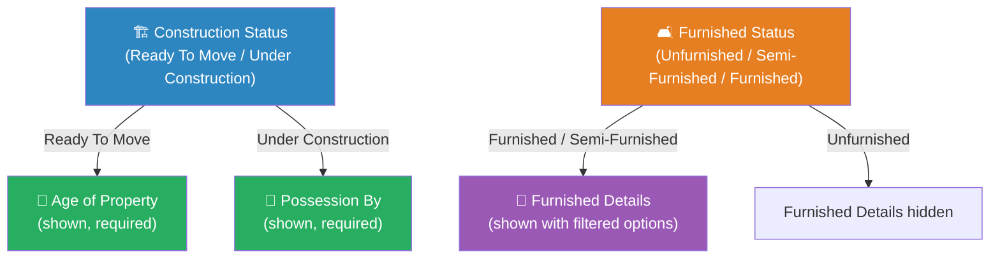
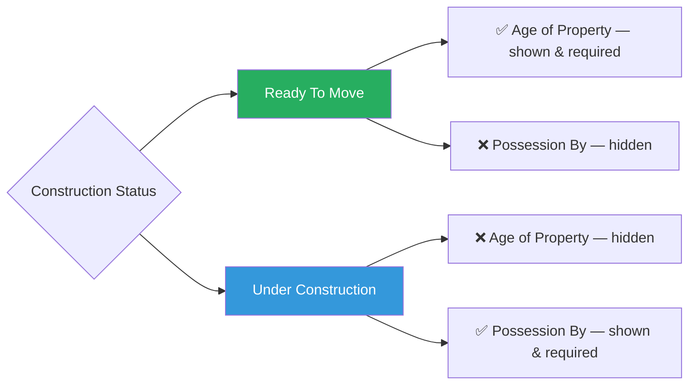
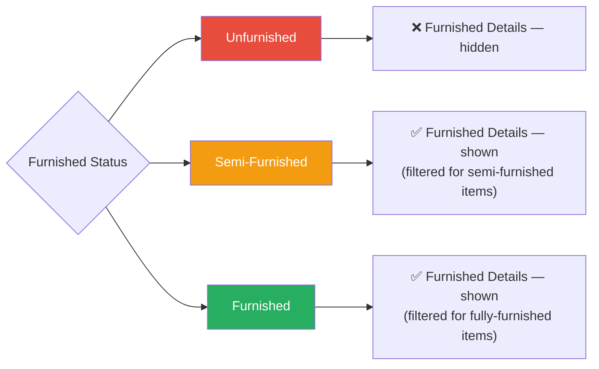
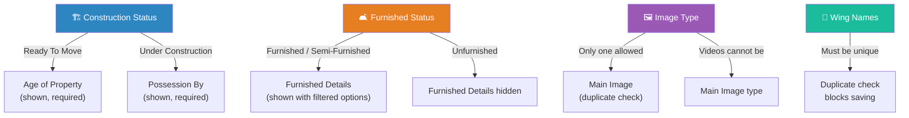

# Add Project Form — Field Guide & Dependencies

> This document explains every field in the **Add / Edit Project** form, what each one does, and how some fields depend on others.

---

## 📋 How the Form Works

Unlike the Property and Lead forms, the Project form does **not** have a Quick / Advance toggle. All fields are visible at all times. The form is organized into **5 sections**:

| # | Section | What it covers |
|:-:|---------|---------------|
| 1 | **Project Info** | Basic details — name, location, developer, construction status |
| 2 | **Project Attributes** | Physical features — area, furnishing, amenities, parking, utilities, media, legal docs |
| 3 | **Nearby Locations** | Points of interest around the project |
| 4 | **Project Layout** | Wing/tower structure — floors and units |
| 5 | **Owner Details** | Private owner contact info (collapsible) |

> [!IMPORTANT]
> The main dependency in this form is **Construction Status**. Changing it determines whether you see the **Age of Property** field or the **Possession By** field. The **Furnished Status** field also controls the **Furnished Details** dropdown.

---

## 🔗 Master Dependency Overview

---

## Section 1: Project Info

| # | Field Name | Required? | What it does |
|---|-----------|:---------:|-------------|
| 1 | **Project Name** | ✅ Yes | The name of the project/society/complex |
| 2 | **Project Rera Number** | No | RERA registration number. Only uppercase letters, numbers, and `/` are allowed |
| 3 | **Developed by** | No | The builder or developer company name |
| 4 | **Market By** | No | The marketing company name |
| 5 | **Locality / Street** | ✅ Yes | Project address — auto-fills from Google Maps or can be changed manually via a popup |
| 6 | **Construction Status** | ✅ Yes | Current state of the project |
| 7 | **Age of Property** | ✅ Yes* | How old the property is — *only shown when Construction Status is "Ready To Move"* |
| 8 | **Possession By** | ✅ Yes* | Expected possession date — *only shown when Construction Status is "Under Construction"* |

### Construction Status Dependency

This is the most important dependency in the form:

| Construction Status selected | Age of Property | Possession By |
|:----------------------------|:---:|:---:|
| **Ready To Move** | ✅ Shown (required) | ❌ Hidden |
| **Under Construction** | ❌ Hidden | ✅ Shown (required) |

### Possession By — Date Shortcuts

When **Possession By** appears, you can either pick a date from a calendar or use quick-select buttons:

| Button | Sets date to |
|--------|-------------|
| Within 3 Months | 3 months from today |
| Within 6 Months | 6 months from today |
| By Next Year | 1 year from today |
| By Next-to-Next Year | 2 years from today |
| By Next-to-Next-to-Next Year | 3 years from today |

### Locality / Street — Address Entry

> [!TIP]
> You can enter the project address in two ways:
> 1. **Type and select** — Start typing and pick a suggestion from Google Maps. This auto-fills Locality, City, State, Pincode, and Country.
> 2. **Manual entry** — Click the **"Change"** link to open a popup where you can type each address field separately (Locality, City, State, Pincode, Country).
>
> Use the **✕** button next to the address to clear it and start over.

---

## Section 2: Project Attributes

| # | Field Name | Required? | What it does |
|---|-----------|:---------:|-------------|
| 9 | **Project Plot / Premises Area** | No | Total project area with a unit selector (Sq. Ft., Sq. Mt., Acres, Hectares, etc.) |
| 10 | **Furnished Status** | No | Unfurnished / Semi-Furnished / Furnished |
| 11 | **Furnished Details** | No | Multi-select list of furnishing items available |
| 12 | **Common Amenities** | No | Multi-select searchable list — Swimming Pool, Gym, Playground, Club House, etc. |
| 13 | **Flooring Info** | No | Multi-select — Marble, Vitrified, Wooden, Granite, etc. |
| 14 | **Car Parking** | No | Multi-select — Covered, Open, etc. |
| 15 | **Water Availability** | No | Multi-select — Municipal, Borewell, 24-hour, etc. |
| 16 | **Electricity Status** | No | Single select — Available, Not Available, etc. |
| 17 | **Landmark / Attraction Details** | No | Free-text to describe notable landmarks near the project |
| 18 | **Approved Banks for Loans** | No | Multi-select — banks that have approved this project for home loans |
| 19 | **Approved By** | No | Multi-select — government/regulatory bodies that approved the project (RERA, Municipal Corporation, etc.) |
| 20 | **Upload Project Images/Videos** | No | Upload images and videos with category tags (Main Image, Floor Plan, Others, etc.) |
| 21 | **Video Link** | No | External video links with a type selector (YouTube, etc.). You can add multiple links (max 10) by clicking **+** |
| 22 | **Upload Legal DOCs** | No | Upload legal documents (PDF, DOC, images) with document type tags. Max file size: 4 MB |
| 23 | **Short Description** | No | Free-text project description |
| 24 | **Publish on Website** | ✅ Yes | Yes / No — whether to show this project on your public website. Only visible if the website module is enabled |

### Furnished Status → Furnished Details

| Furnished Status selected | Furnished Details |
|:-------------------------|:---:|
| **Unfurnished** | ❌ Hidden |
| **Semi-Furnished** | ✅ Shown (semi-furnished item options) |
| **Furnished** | ✅ Shown (fully-furnished item options) |

### Image Upload Rules

> [!NOTE]
> - You can upload both **images** and **videos**
> - **Maximum 3 videos** can be uploaded per project
> - Each image/video must be assigned a **type** (Main Image, Floor Plan, Others, etc.)
> - You cannot select **"Main Image"** more than once — the system will prevent duplicates
> - Images are automatically **compressed** and converted to **WebP** format for optimal performance
> - **Maximum video file size**: 50 MB per video

### Legal Documents

> [!NOTE]
> - Supported formats: **GIF, JPG, PNG, JPEG, PDF, DOC, DOCX**
> - **Maximum file size**: 4 MB per document
> - Each document can be tagged with a **type** (Sale Deed, Agreement, NOC, etc.)

---

## Section 3: Nearby Locations

This section lets you add points of interest around the project.

| # | Field Name | Required? | What it does |
|---|-----------|:---------:|-------------|
| 25 | **Location Category** | No | Type of nearby place — School, Hospital, Railway Station, Bus Stop, Shopping Mall, etc. |
| 26 | **Place Name** | No | Name of the specific place (max 50 characters) |
| 27 | **Distance** | No | How far the place is, with a unit selector |
| 28 | **Distance Unit** | No | Kilometer / Meter / Minutes |

### Adding Multiple Locations

- Click the **+** button to add more nearby locations
- You can add up to **30** nearby locations per project
- Click the **✕** button to remove a location entry

---

## Section 4: Project Layout

This section defines the building structure (wings/towers).

| # | Field Name | Required? | What it does |
|---|-----------|:---------:|-------------|
| 29 | **Wing Name** | ✅ Yes | Name of the wing or tower (e.g., "A Wing", "Tower 1"). Max 12 characters |
| 30 | **Total Floor** | ✅ Yes | Number of floors in this wing. Maximum 100 |
| 31 | **Property per Floor** | ✅ Yes | Number of units/flats per floor. Maximum 20 |

### Layout Rules

> [!WARNING]
> - **Wing names must be unique** — you cannot have two wings with the same name. The system will highlight duplicates in red and block saving.
> - You can add up to **30 wings** per project using the **+** button
> - For existing projects, changing floor count or units per floor is validated against existing properties — the system warns you if properties are already associated with a wing and prevents removal.

---

## Section 5: Owner Details (Private / Collapsible)

This section is **collapsed by default**. Click **"Add Owner Details"** to expand it.

> [!IMPORTANT]
> These details are **private** — they are only visible to you and your team. They will **NOT** be shared when sharing the project with leads or customers.

| # | Field Name | Required? | What it does |
|---|-----------|:---------:|-------------|
| 32 | **Name** | No | Owner's full name |
| 33 | **Contact** | No | Owner's phone number (must be exactly 10 digits) |
| 34 | **Email Id** | No | Owner's email address |
| 35 | **Private Description** | No | Internal notes about the owner or project that should not be shared |

---

## 🗺️ Complete Dependency Map

---

## Quick Reference: What Depends on What

| When you change... | These fields are affected |
|--------------------|--------------------------|
| **Construction Status** (Ready To Move / Under Construction) | Age of Property (shown for Ready To Move), Possession By (shown for Under Construction) |
| **Furnished Status** (Unfurnished / Semi-Furnished / Furnished) | Furnished Details dropdown — hidden for Unfurnished, shown with filtered options for others |
| **Image Type selection** | "Main Image" can only be selected once — system prevents duplicate selection |
| **Wing Name** | Must be unique across all wings — duplicates are highlighted in red and block form submission |

---

## Validation Rules

| Field | Rule |
|-------|------|
| Project Name | Required |
| Project Rera Number | Only uppercase letters, numbers, and `/` allowed |
| Locality / Street | Required |
| Construction Status | Required |
| Age of Property | Required when Construction Status = "Ready To Move" |
| Possession By | Required when Construction Status = "Under Construction" |
| Wing Name | Required, max 12 characters, must be unique |
| Total Floor | Required, numeric, between 1 and 100 |
| Property per Floor | Required, numeric, between 1 and 20 |
| Owner Contact | Must be exactly 10 digits (if entered) |
| Legal Documents | Max 4 MB each; allowed: GIF, JPG, PNG, JPEG, PDF, DOC, DOCX |
| Project Images/Videos | Max 3 videos, max 50 MB per video; only one "Main Image" allowed |
| Nearby Locations | Max 30 entries; Place Name max 50 characters |
| Video Links | Max 10 links |
| Publish on Website | Required (if website module is enabled) |

